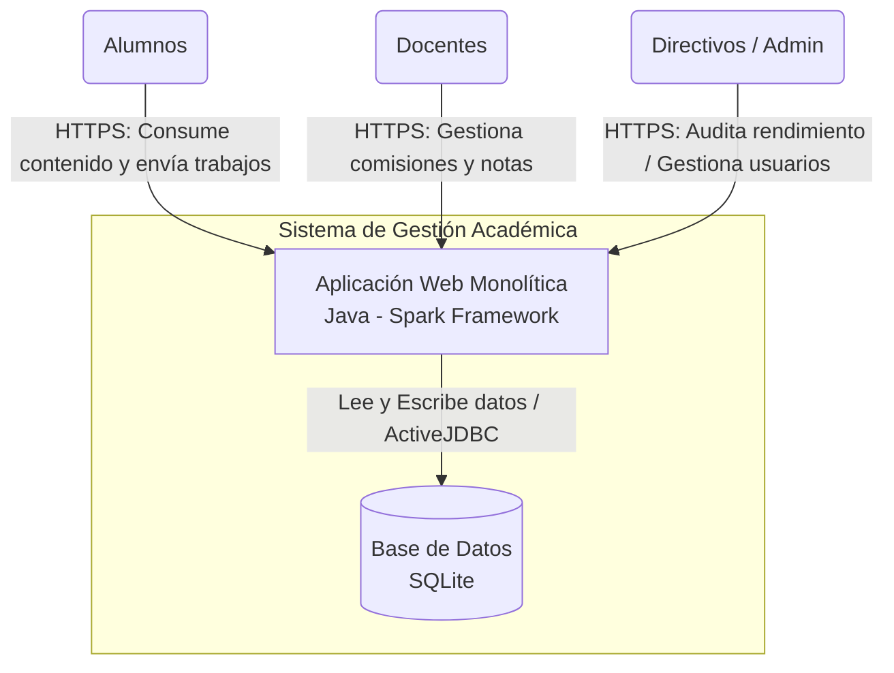

# Proyecto Ingeniería de Software II: Especificación, Gestión y Planificación

**Integrantes:** Candela Sangroniz, Chambi Agustín, Gillo Celina

## 1. Problema que se quiere resolver
La institución carece de una plataforma unificada, intuitiva y accesible para la gestión académica y la comunicación. Los procesos descentralizados dificultan el seguimiento del rendimiento de los alumnos y docentes, y no existe un canal oficial y directo para la interacción dentro de las comisiones. Se requiere un sistema que centralice la información, mejore la experiencia de usuario (UX) y ofrezca herramientas de evaluación y comunicación segmentadas por roles.

## 2. Usuarios del sistema
* **Alumnos:** Consumen contenido, se inscriben a materias, envían trabajos y revisan su propia evolución.
* **Docentes (Profesores):** Gestionan sus comisiones, asignan horarios, suben notas, registran asistencias y se comunican con los alumnos.
* **Directivos:** Tienen un perfil analítico y de auditoría para evaluar el panorama educativo general (sin acceso a comunicaciones privadas de las clases).
* **Administradores:** Gestionan el soporte técnico y la creación/baja de usuarios y materias base.

## 3. Funcionalidades principales
* **Gestión de Accesos y Roles:** Áreas de sistema y permisos estrictamente diferenciados según el tipo de usuario.
* **Módulo de Inscripción y Planificación:** Inscripción de alumnos a materias y asignación de horarios/comisiones por parte de los docentes.
* **Aula Virtual y Comunicación:** Tablero de comunidad por comisión y mensajería privada entre docente y alumno.
* **Módulo de Seguimiento y Reportes:** Carga de notas, asistencias y entregas (prácticos/teóricos). Tableros de análisis de rendimiento para que los directivos evalúen la evolución educativa.
* **Sistema de Notificaciones / Calendario:** Un panel simple para alertas (ej. "Nueva nota cargada") o fechas de entregas.

## 4. Cambios de alcance ocurridos
El proyecto evoluciona de un simple registro administrativo de profesores y usuarios a un entorno académico integral. Se amplía el alcance para incluir la interacción directa en un "aula virtual", el manejo de inscripciones a comisiones y la generación de métricas de rendimiento para la toma de decisiones directivas.

## 5. Restricciones técnicas
* **Compatibilidad heredada:** El sistema debe mantener retrocompatibilidad con la arquitectura base del año anterior (Java puro con gestor de dependencias Maven).
* **Renderizado del lado del servidor:** La interfaz debe seguir utilizando el motor de plantillas Mustache, limitando el uso de frameworks frontend reactivos complejos para mantener la simpleza del proyecto original.

## 6. Tamaño del equipo
El equipo está conformado por 3 integrantes.

## 7. Tecnologías elegidas y justificación
* **Backend:** Java con Maven (Tipado fuerte y robustez para soportar la nueva estructura de roles).
* **Frontend:** HTML5, CSS3 y Mustache (Curva de aprendizaje baja, interfaces accesibles e inyección dinámica sencilla).
* **Base de Datos:** SQLite (Ideal para el alcance del proyecto y fácil de compartir sin necesidad de servidores externos).
* **Herramientas de desarrollo:** VS Code y GitHub (GitHub Projects para gestión de backlog).

## 8. Plazo estimado
**3 a 4 meses (aprox. 12-14 semanas).** El desarrollo se dividirá en iteraciones cortas aprovechando la asistencia de herramientas de Inteligencia Artificial para agilizar la codificación rutinaria y la generación de casos de prueba, permitiendo enfocar el mayor esfuerzo humano en la arquitectura, reglas de negocio y revisión de calidad.

## 9. Problemas encontrados
* **Deuda técnica inicial:** Al hacer el pull del proyecto anterior, se detectó la necesidad de refactorizar parte del código base para soportar la nueva estructura de roles (directivos, alumnos, etc.) sin romper las funcionalidades existentes (login y gestión básica).
* **Curva de adaptación:** Necesidad de coordinar el estilo de código entre los 3 integrantes nuevos, ya que cada uno tiene metodologías de trabajo distintas provenientes de otros equipos.

## 10. Forma de organización del equipo
El equipo adoptará una estructura colaborativa enfocada en la complementariedad, la coordinación y la comunicación continua. Para evitar cuellos de botella, dividiremos el proyecto por responsabilidades principales, apoyándonos mutuamente:
* **Chambi Agustín (Gestor/Backend):** Responsable de mantener actualizado el GitHub Projects, asegurar el cumplimiento del cronograma y liderar la lógica de negocio en Java.
* **Candela Sangroniz (Frontend/UX):** Lidera el desarrollo de las vistas en HTML/CSS y Mustache, garantizando que la interfaz sea accesible e intuitiva.
* **Celina Gillo (Datos/QA):** Encargada de evolucionar el esquema en SQLite (`scheme.sql`), además de definir y validar los criterios de aceptación (pruebas) antes de fusionar el código.


## 2. (Auditoría) Análisis de riesgos con IA y Equipo


### a y b. Identificación de Riesgos

| Tipo de Riesgo | Descripción | Probabilidad | Impacto | Identificado por |
| :--- | :--- | :--- | :--- | :--- |
| **Técnico** | Conflictos de concurrencia y bloqueos de escritura en SQLite si múltiples usuarios cargan datos simultáneamente. | Alta | Crítico | IA |
| **Técnico** | La refactorización de la arquitectura heredada para soportar nuevos perfiles rompe funcionalidades previas (ej. login). | Media | Alto | IA |
| **Organizacional**| Conflictos de integración en GitHub (merge conflicts) debido a diferencias en estilos y metodologías de codificación. | Media | Medio | IA |
| **Planificación** | Subestimar la complejidad de implementar la mensajería del aula virtual en Mustache, retrasando los hitos. | Alta | Crítico | IA |
| **Planificación** | Desviación en la estimación de tiempos para configurar el esquema de base de datos (`scheme.sql`) con las nuevas entidades. | Media | Medio | IA |
| **Humano** | Cuello de botella y sobrecarga de tareas en el rol de Backend, frenando el avance del Frontend y QA. | Baja | Alto | IA |
| **Humano** | Ausencia prolongada o falta de disponibilidad de un integrante clave cerca de las fechas de presentación. | Baja | Crítico | IA |
| **Técnico** | Problemas de integración entre el backend y la base de datos (SQLite), generando errores de conexión o consultas mal formuladas. | Media | Medio | Agustín |
| **Técnico** | Curva de aprendizaje pronunciada frente a nuevas librerías y dificultad para formular instrucciones precisas (prompts) al usar IA. | Alta | Crítico | Agustín |
| **Organizacional**| Descoordinación del equipo y comunicación deficiente, resultando en mala priorización de tareas y solapamiento de esfuerzos. | Alta | Alto | Agustín |
| **Planificación** | Estancamiento temporal en el desarrollo de tareas de alta complejidad, provocando retrasos en el cronograma general. | Media | Alto | Agustín |
| **Humano** | Entorno de desarrollo local mal configurado o ausencia de un ecosistema de herramientas estandarizado. | Baja | Medio | Agustín |
| **Humano** | Dependencia del código generado por IA sin contar con la base técnica para auditarlo, comprender su lógica o solucionar errores. | Alta | Alto | Agustín |

### 2.c Comparación de los Análisis (IA vs. Equipo)

**Riesgos que encontró la IA y el equipo no:**
* **Conflictos de arquitectura y concurrencia:** La IA identificó problemas específicos de las tecnologías elegidas (bloqueos en SQLite, romper el login heredado).
* **Cuellos de botella por roles:** La IA previó que un rol específico (Backend) podría sobrecargarse y frenar al resto.
* **Conflictos en el SCM:** Identificó el riesgo de *merge conflicts* en GitHub al integrar el código de integrantes con metodologías distintas.

**Riesgos que encontró Agustín y la IA no:**
* **Dependencia y auditoría de IA:** Riesgo fundamental que la IA pasó por alto: la dificultad humana de formular buenos *prompts* y el peligro de integrar código de IA sin saber debuggearlo.
* **Ecosistema de desarrollo:** Se identificó la falta de un entorno de trabajo local estandarizado, un riesgo organizativo vital antes de empezar a programar.
* **Curva de aprendizaje real:** Reconocemos la falta de práctica previa con las librerías necesarias, lo que impacta directamente en los tiempos de desarrollo.

**Calidad del análisis:**
Ambos análisis resultan altamente exhaustivos y complementarios.
La IA aportó una visión "de manual" enfocada en la arquitectura del software y las limitaciones tecnológicas. Por otra parte con el equipo tuvimos una visión pragmática e introspectiva de la nuestra realidad como equipo, reconociendo el desafío concreto de adoptar herramientas de IA y la importancia de estandarizar el entorno de trabajo.


### 3. Diagramas de Arquitectura del sistema y diagrama de diseño


**Diagrama de Arquitectura del sistema:**
Este diagrama muestra las piezas grandes de software que componen el sistema y cómo los usuarios interactúan con él.



**Diagrama de Componentes / Diseño interno:**
Este diagrama muestra cómo están organizadas las partes internas del software y cómo se comunican entre sí.
Estamos usando una variante del patrón MVC (Modelo-Vista-Controlador) adaptada para Spark.

1. El Enrutador (App.java) recibe la petición.

2. Delega la lógica a los Controladores (ProfessorController).

3. Estos hablan con los Modelos (Person, Professor, User) usando ActiveJDBC.

4. Los modelos usan tu Singleton (DBConfigSingleton) para tocar la base de datos.

5. Finalmente, devuelven todo a las Vistas (.mustache) para renderizar el HTML.

```mermaid
graph TD
    Cliente[Browser del Usuario]

    subgraph Backend - Arquitectura MVC (Spark)
        Router(Enrutador<br/>App.java)
        Controllers(Controladores<br/>ej. ProfessorController)
        Models(Modelos ORM<br/>ej. User, Professor)
        Views(Motor de Plantillas<br/>Vistas Mustache)
        Config(Configuración<br/>DBConfigSingleton)
    end

    subgraph Persistencia
        SQLite[(Base de Datos<br/>dev.db / prod.db)]
    end

    %% Flujo de una petición HTTP
    Cliente -->|1. HTTP Request| Router
    Router -->|2. Delega lógica de negocio| Controllers
    Controllers -->|3. Consulta/Actualiza| Models
    Models -.->|4. Obtiene conexión| Config
    Config -->|5. Consultas JDBC| SQLite
    Controllers -->|6. Pasa modelo de datos| Views
    Views -->|7. Renderiza HTML plano| Cliente
```


## 4. Gestión del Backlog e Issues (GitHub Projects)


Para mantener una organización ágil y centralizada, utilizamos **GitHub Projects** configurado como un tablero Kanban. El *Product Backlog* se compone de *Issues*, donde cada uno representa una unidad de trabajo accionable. 

Para garantizar la calidad (SQA), hemos establecido que ningún *Issue* puede moverse a la columna "Done" sin antes cumplir con sus **Criterios de Aceptación** específicos (Definition of Done).

A continuación, detallamos los Issues fundamentales del primer ciclo de desarrollo (Sprint 1), desglosando sus componentes según lo requerido:

---

### Issue #1: Configuración del entorno base y Script de Base de Datos
* **Tipo de Tarea:** Gestión / Técnica
* **Descripción:** Para evitar problemas de compatibilidad en el equipo, es necesario estandarizar el entorno local. Se debe crear el archivo `scheme.sql` con las tablas iniciales adaptadas a SQLite (`users`, `persons`, `professors`) y asegurar que el proyecto levante correctamente con Maven.
* **Estimación:** 3 Puntos de Historia.
* **Responsable:** Celina Gillo (Datos/QA).
* **Prioridad:** Alta (Blocker).
* **(SQA) Criterios de Aceptación:**
  * El script `scheme.sql` se ejecuta en la consola local sin arrojar errores de sintaxis.
  * El proyecto compila correctamente con `mvn clean compile`.
  * La aplicación inicia (servidor Spark en el puerto 8081) y crea exitosamente el archivo `dev.db`.

---

### Issue #2: Refactorización de Arquitectura y Sistema de Login
* **Tipo de Tarea:** Feature / Refactor
* **Descripción:** El sistema base heredado debe adaptarse para soportar múltiples roles de usuario (Alumnos, Docentes, Directivos). Se debe refactorizar el enrutador en `App.java` y asegurar que la sesión HTTP (`req.session()`) maneje correctamente el estado de autenticación.
* **Estimación:** 8 Puntos de Historia.
* **Responsable:** Chambi Agustín (Backend).
* **Prioridad:** Alta.
* **(SQA) Criterios de Aceptación:**
  * Los tests unitarios existentes en `AppTest.java` pasan exitosamente.
  * Al ingresar credenciales inválidas, el sistema redirige a `/login` con un mensaje de error explícito.
  * Al iniciar sesión correctamente, la sesión se guarda y se redirige al `/dashboard`.

---

### Issue #3: Lógica Backend para "Alta de Profesor" (HU-001)
* **Tipo de Tarea:** Feature
* **Descripción:** Implementar el controlador (`ProfessorController.java`) y los modelos ORM de ActiveJDBC (`Person`, `Professor`) para registrar nuevos docentes en la base de datos, validando la unicidad de datos sensibles.
* **Estimación:** 5 Puntos de Historia.
* **Responsable:** Chambi Agustín (Backend).
* **Prioridad:** Alta.
* **(SQA) Criterios de Aceptación:**
  * El sistema rechaza peticiones HTTP POST si faltan campos obligatorios.
  * Se verifica en la base de datos que el DNI o el Correo no existan previamente.
  * Se insertan registros vinculados correctamente en la tabla `persons` y en la tabla `professors` (asegurando la FK).

---

### Issue #4: Formulario UI/UX para "Alta de Profesor" (HU-001)
* **Tipo de Tarea:** Feature
* **Descripción:** Maquetar la vista `profesor_form.mustache`. El formulario debe contener los campos necesarios para dar de alta a un docente y presentar un diseño limpio, responsivo y coherente con el sistema.
* **Estimación:** 3 Puntos de Historia.
* **Responsable:** Candela Sangroniz (Frontend/UX).
* **Prioridad:** Media.
* **(SQA) Criterios de Aceptación:**
  * El HTML está estructurado y estilizado con Tailwind CSS (adaptable a móviles y escritorio).
  * Se muestran visualmente los bloques `{{errorMessage}}` y `{{successMessage}}` cuando el servidor los inyecta.
  * El botón "Cancelar" redirige exitosamente al dashboard.

---

### Issue #5: Configuración de Datos de Prueba (Seeders)
* **Tipo de Tarea:** Gestión / Spikes
* **Descripción:** Crear un script SQL secundario o una clase Java que inyecte datos de prueba (profesores, alumnos y usuarios admin) en la base de datos `dev.db` para agilizar las pruebas manuales de UI y Backend.
* **Estimación:** 2 Puntos de Historia.
* **Responsable:** Celina Gillo (Datos/QA).
* **Prioridad:** Media.
* **(SQA) Criterios de Aceptación:**
  * Existe un método documentado para poblar la base de datos con al menos 3 usuarios de distintos roles.
  * Las contraseñas de los usuarios de prueba están correctamente encriptadas con BCrypt para permitir el login.

---

### Issue #6: Pruebas de Integración (ActiveJDBC)
* **Tipo de Tarea:** Investigación / Testing
* **Descripción:** Configurar el entorno de pruebas (`pom.xml` profile "test") y redactar los primeros tests de integración usando JUnit para validar que el ORM guarde y recupere entidades `Professor` correctamente.
* **Estimación:** 5 Puntos de Historia.
* **Responsable:** Celina Gillo (Datos/QA).
* **Prioridad:** Baja (Deseable para el Sprint 1).
* **(SQA) Criterios de Aceptación:**
  * La ejecución de `mvn test` no interfiere con la base de datos de desarrollo (`dev.db`).
  * Existe al menos un test que verifique la restricción de unicidad del DNI al intentar guardar dos profesores iguales.
  * 


## 5. (Estimation) Estimación del Backlog


Para estimar el esfuerzo necesario para completar cada tarea del Backlog, el equipo ha decidido descartar la estimación en "horas ideales" (debido a su alto margen de error frente a imprevistos) y utilizar la técnica ágil de **Puntos de Historia (Story Points)** basada en la serie de **Fibonacci (1, 2, 3, 5, 8, 13)**.

Esta métrica nos permite evaluar cada *Issue* de manera relativa, ponderando tres variables fundamentales:
1. **Esfuerzo operativo:** El volumen de trabajo a realizar.
2. **Complejidad técnica:** La dificultad lógica o algorítmica.
3. **Riesgo e Incertidumbre:** La claridad de los requerimientos y el peligro de tocar código heredado (deuda técnica).

A continuación, detallamos las estimaciones registradas en nuestro GitHub Projects para el Sprint inicial, justificando el valor asignado a cada tarea:

* **Issue #1: Configuración del entorno base y Script de BD**
  * **Estimación: 3 Puntos.**
  * **Justificación:** Es una tarea de complejidad técnica baja, pero requiere un esfuerzo de coordinación moderado para asegurar que los tres miembros del equipo tengan el entorno (`dev.db`, dependencias Maven) corriendo idénticamente.

* **Issue #2: Refactorización de Arquitectura y Sistema de Login**
  * **Estimación: 8 Puntos.**
  * **Justificación:** Es la tarea de mayor peso. Presenta un alto nivel de **Riesgo/Incertidumbre** al tener que modificar el enrutador (`App.java`) heredado de una versión anterior. Un error aquí rompe el acceso a toda la aplicación. Requiere alta concentración y testing riguroso.

* **Issue #3: Lógica Backend para "Alta de Profesor"**
  * **Estimación: 5 Puntos.**
  * **Justificación:** Tarea de complejidad media. Involucra lógica de negocio clara (validaciones de campos), pero requiere asegurar la integridad referencial al escribir en dos tablas distintas (`persons` y `professors`) utilizando el ORM ActiveJDBC.

* **Issue #4: Formulario UI/UX para "Alta de Profesor"**
  * **Estimación: 3 Puntos.**
  * **Justificación:** Tarea de bajo riesgo y complejidad controlada. El maquetado web y la inyección de variables Mustache (`{{errorMessage}}`) es un proceso directo que el equipo domina, requiriendo principalmente esfuerzo operativo para la estilización con Tailwind.

* **Issue #5: Configuración de Datos de Prueba (Seeders)**
  * **Estimación: 2 Puntos.**
  * **Justificación:** Tarea sencilla. Crear un script de inserción (INSERT INTO) requiere poco esfuerzo, baja complejidad y el riesgo es nulo, ya que solo afecta al entorno de desarrollo local.

* **Issue #6: Pruebas de Integración (ActiveJDBC)**
  * **Estimación: 5 Puntos.**
  * **Justificación:** Aunque escribir el test en sí es rápido, el **esfuerzo y complejidad** radican en configurar correctamente el perfil de Maven (`test` profile) para que JUnit levante una base de datos en memoria separada sin corromper los datos de desarrollo.
  

## 6. (SCM) Roadmap e Hitos del Proyecto (GitHub Projects)


Esta herramienta nos permite agrupar los *Issues* del Backlog en entregables de valor cohesivos y monitorear el progreso macro del proyecto mediante un diagrama de Gantt automatizado.

Hemos dividido el desarrollo en cuatro hitos principales:

### Hito 1: Setup y MVP Arquitectónico (Semanas 1-3)
* **Objetivo:** Estandarizar el entorno de desarrollo, configurar la base de datos y asegurar que la arquitectura base (ruteo y login) funcione con el nuevo esquema de roles.
* **Entregables clave:** Entornos locales configurados, `scheme.sql` implementado, Login refactorizado operativo y datos semilla (Seeders) generados.
* **Issues asociados (Sprint 1):** #1, #2, #5, #6.

### Hito 2: Módulo de Gestión Administrativa (Semanas 4-6)
* **Objetivo:** Completar el sistema de altas, bajas y modificaciones (ABM) para todos los actores del sistema, permitiendo al Administrador preparar el terreno para el ciclo lectivo.
* **Entregables clave:** ABM de Profesores (Backend y UI), ABM de Alumnos, ABM de Directivos, y asignación de permisos según el rol logueado.
* **Issues asociados (Ejemplo):** #3, #4.

### Hito 3: Aula Virtual e Inscripciones (Semanas 7-10)
* **Objetivo:** Desarrollar el núcleo interactivo y académico de la plataforma.
* **Entregables clave:** Lógica de inscripción a materias para Alumnos, creación de comisiones por parte de Profesores, carga de notas y módulo de mensajería asíncrona dentro del aula virtual.
* **Riesgo asociado:** Es la fase de mayor complejidad técnica al tener que gestionar alta concurrencia en la base de datos SQLite y múltiples relaciones entre tablas.

### Hito 4: Reportes, Auditoría y Despliegue (Semanas 11-13)
* **Objetivo:** Finalizar las herramientas de análisis para los Directivos, asegurar la calidad general del software y preparar la entrega final.
* **Entregables clave:** Tableros de rendimiento para el rol Directivo (vistas de solo lectura), sistema simple de notificaciones, QA intensivo (limpieza de *bugs* y deuda técnica) y armado de la presentación final del integrador.


## 7. (SCM) Seguimiento, Control y Burndown Chart


La gestión de la configuración y el seguimiento del proyecto (SCM) requiere medir empíricamente el avance del equipo. Dado que actualmente nos encontramos en la fase de planificación del Sprint 1 (Hito 1), el gráfico de *Burndown* final se generará al concluir la iteración. 

Sin embargo, hemos definido la siguiente metodología estricta para registrar el tiempo, analizar desviaciones y construir nuestras métricas.

### A. Metodología de Registro (Tracking)
Para comparar las estimaciones relativas (*Story Points*) con el esfuerzo absoluto, el equipo utilizará una matriz de seguimiento. Cada integrante es responsable de registrar las horas netas de codificación/investigación al mover un Issue a la columna "Done" en GitHub Projects.

**Plantilla de Control de Iteración (Sprint 1 - Ejemplo Base):**

| ID | Issue / Tarea | Responsable | Estimación (Story Points) | Tiempo Real (Horas) | Desviación | Estado |
| :--- | :--- | :--- | :---: | :---: | :--- | :--- |
| #1 | Configuración BD (`scheme.sql`) | Celina Gillo | 3 SP | *A registrar* | *A evaluar* | Todo |
| #2 | Refactor Login y MVC | Chambi Agustín | 8 SP | *A registrar* | *A evaluar* | Todo |
| #3 | Backend Alta Profesor | Chambi Agustín | 5 SP | *A registrar* | *A evaluar* | Todo |
| #4 | Frontend UI/UX Alta Profesor | Candela Sangroniz | 3 SP | *A registrar* | *A evaluar* | Todo |
| #5 | Datos de Prueba (Seeders) | Celina Gillo | 2 SP | *A registrar* | *A evaluar* | Todo |
| #6 | Pruebas de Integración (JUnit) | Celina Gillo | 5 SP | *A registrar* | *A evaluar* | Todo |
| **-** | **TOTALES SPRINT 1** | **Equipo** | **26 SP** | **-** | **-** | **-** |

### B. Análisis de Desviaciones
Al finalizar el Sprint, el equipo realizará una retrospectiva obligatoria para analizar la matriz de seguimiento. Las desviaciones se clasificarán y justificarán bajo los siguientes criterios:

1. **Subestimación Técnica:** La curva de aprendizaje de herramientas como ActiveJDBC o Mustache fue más pronunciada de lo previsto.
2. **Deuda Técnica Heredada:** Modificar el código base (ej. el enrutador en `App.java`) requirió refactorizaciones imprevistas que consumieron horas adicionales.
3. **Bloqueos de Entorno:** Problemas locales (VS Code, Maven, dependencias de SQLite) que frenaron la velocidad del equipo.

Calcular esta desviación nos permitirá descubrir la **Velocidad Real** del equipo (cuántas horas efectivas nos toma resolver 1 Story Point), lo que calibrará las estimaciones de los Hitos 2, 3 y 4.

### C. Construcción del Burndown Chart
El progreso diario se visualizará mediante un *Burndown Chart* construido en una hoja de cálculo, el cual cruzará dos ejes:
* **Eje Y (Esfuerzo Pendiente):** Comenzará en el límite superior de **26 Story Points** correspondientes a las tareas comprometidas para el Sprint 1.
* **Eje X (Tiempo):** Representará los días hábiles que dura el Sprint.

A medida que los Issues #1 al #6 pasen a "Done", se restarán sus *Story Points* del total. La gráfica resultante expondrá una "Línea Real" de trabajo restante frente a una "Línea Ideal" (descenso constante). Si la Línea Real se mantiene por encima de la Ideal, el equipo sabrá inmediatamente que existe un retraso y deberá gestionar un ajuste de alcance o de esfuerzo.